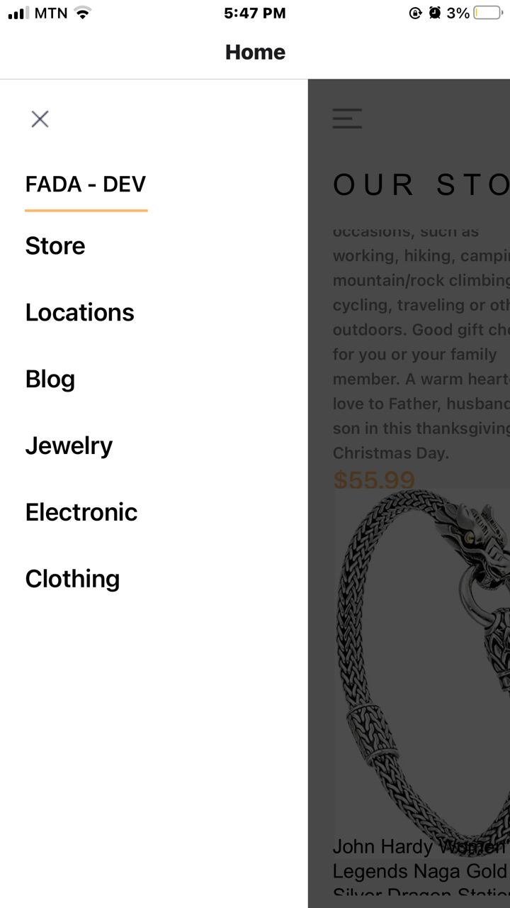

# rn-assignment7-11313275

# Supermarket App

## Overview
This Supermarket App is built using React Native and provides a seamless shopping experience. It fetches product data from an external API and stores cart data locally using AsyncStorage. The app consists of three main screens: HomeScreen, ProductDetailScreen, and CartScreen, each with specific functionalities and design choices to enhance user experience.

## Design Choices
### HomeScreen
- **Drawer Menu:** Implemented using `react-native-gesture-handler`'s `DrawerLayout` to provide an easy navigation experience.
- **Product List:** Displays products in a grid layout using `FlatList`. Each product card includes an image, title, description, price, and an add-to-cart button.
- **Header:** Includes a menu button, logo, search button, and cart button for easy access.

### ProductDetailScreen
- **Detailed View:** Shows a larger image of the product, detailed description, price, and shipping information.
- **Icons:** Provides additional information about the product care instructions using icons.
- **Add to Basket:** Includes an 'Add to Basket' button to add the product directly to the cart.

### CartScreen
- **Cart Management:** Displays all products added to the cart with the ability to remove items.
- **Estimated Total:** Shows the total price of all items in the cart.
- **Checkout:** Provides a checkout button to proceed with the purchase.

## Data Storage
- **AsyncStorage:** Used for storing and retrieving cart data locally on the user's device. This ensures that the cart persists even after the app is closed and reopened.

## Screenshots
### HomeScreen

### MenuScreen

### ProductDetailScreen

##

### CartScreen
